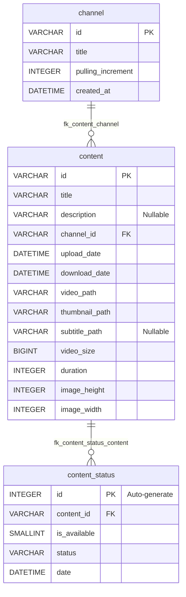

# auto-dl_java

## TODO:

Create a database server to connect to.

create the following config files:
1. Secret
2. Config

### Database

This project is built on the following structure


in code:
```sql
CREATE TABLE channel (
    id VARCHAR(255) PRIMARY KEY,
    title VARCHAR(255) NOT NULL,
    pulling_increment INTEGER NOT NULL,
    created_at DATETIME NOT NULL
);

CREATE TABLE content (
    id VARCHAR(255) PRIMARY KEY,
    title VARCHAR(255) NOT NULL,
    description VARCHAR(255),
    channel_id VARCHAR(255) NOT NULL,
    upload_date DATETIME NOT NULL,
    download_date DATETIME NOT NULL,
    video_path VARCHAR(255) NOT NULL,
    thumbnail_path VARCHAR(255) NOT NULL,
    subtitle_path VARCHAR(255),
    video_size BIGINT NOT NULL,
    duration INTEGER NOT NULL,
    image_height INTEGER NOT NULL,
    image_width INTEGER NOT NULL,
    FOREIGN KEY (channel_id) REFERENCES channel(id)
);

CREATE TABLE content_status (
    id INTEGER PRIMARY KEY AUTO_INCREMENT,
    content_id VARCHAR(255) NOT NULL,
    is_available SMALLINT NOT NULL,
    status VARCHAR(255) NOT NULL,
    date DATETIME NOT NULL,
    FOREIGN KEY (content_id) REFERENCES content(id)
);
```

### 1 secret.properties

create a file called **secret.properties** at `req/secret.properties`.
Configrue this file using the template below:

```properties
db_host=localhost
db_port=3306
db_name=autodl
db_username=autodl_user
db_password=autodl_user_password
```
>Edit these values, so they line up with your database configuration.

### 2 config.properties

create a file called **config.properties** at `req/config.properties`.
Configrue this file using the template below:

```properties
video_download_dir=/Users/david/Desktop/
thumbnail_download_dir=/Users/david/Desktop/
subtitles_download_dir=~/Desktop/
```
>Edit these values, so they line up with your data storage preferences